# simuPACT

simuPACT is a simulation tool mostly following Oezgurt and Schinitzler (2011) to study phase-amplitude coupling analysis. One can set the following parameters.
See the left panel of the following GUI.

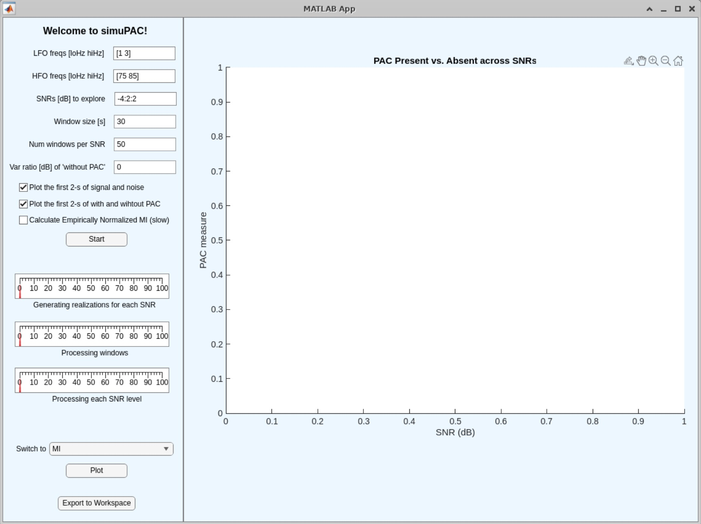

1. **LFO freqs**: The frequency range of the low-frequency phase. A pair of numbers in the increasing order specifies -6db cutoff point. The band-pass filter used is a Hamming window FIR (-53dB/oct). The transition bandwidth for the low-freq phase is determined by min([lower edge of the low-freq]*2 [bandwidth of the low-freq range]). Similarly, that for the high-freq phase is determined by min([lower edge of the high-freq band]*0.1 [bandwidth of the high-freq range]).
2. **HFO freqs**: The frequency range of the high-frequency amplitude. Note that the lower edge of the high-freq range must belarger than (mean of the low-freq range) + (bandwidth of the low-freq range) + (bandwidth of the high-freq range)
3. **SNRs to explore**: Signal-to-noise ratio (SNR) between the variance of simulated PAC's high-freq signal (i.e. band-pass filtered white noise) and the variance of the pink noise. Note that SNR is defined only by variances of high-freq signals. [-4:2:2] is the same as [-4 -2 0 2].
4. **Window size**: Window size in second. Generally, the longer the window, the higher the detection performance.
5. **Num windows per SNR**: The numbers of windows per SNR level. This determines how many iterations for one condition. The higher the value, the better the Gaussian modeling.
6. **Var ratio of without PAC**: Variance ratio of the 'without PAC' signals in decibel. 0 (dB) means the exact matching of variance within the specified high-freq range between PAC Present and PAC absent. The higher the value, the poorer the standard MI's performance (which should be confirmed by running the simulator--this is one of the learning points).
- **Plot the first 2-s of signal and noise**: When checked, this option opens a separate window to display the line plots. The blue line represents the simulated signal and the red line represents the simulated pink noise. The 'PAC present' data are created by addthing these signal and noise. Note also that the SNR is specified for the entire data, and the selected samples shown do not necessarily follow the expected tendency.
- **Calculate Empirically Normalized MI (slow)**: When checked, normalized MI is calculated using empirically estimated signal variance. It uses surrogate data that are MI of amplitude-randomied data. Oezkurt and Schnitzler (2011) reported this approach has a good property. The drawback of this approach is it is slow because of iterations for calculating the surrogate data. The number of iteration is fixed to 200 per Oezkurt and Schnitzler (2011) which says '(typically around 200 times)'. Indeed, as the variance ratio [dB] increases, the performance of the standard MI becomes worsen, but normMI is unaffected. However, for the practical purpose, choosing robust GLM is faster and more sensitive, which you can confirm by using this simulator. 
    
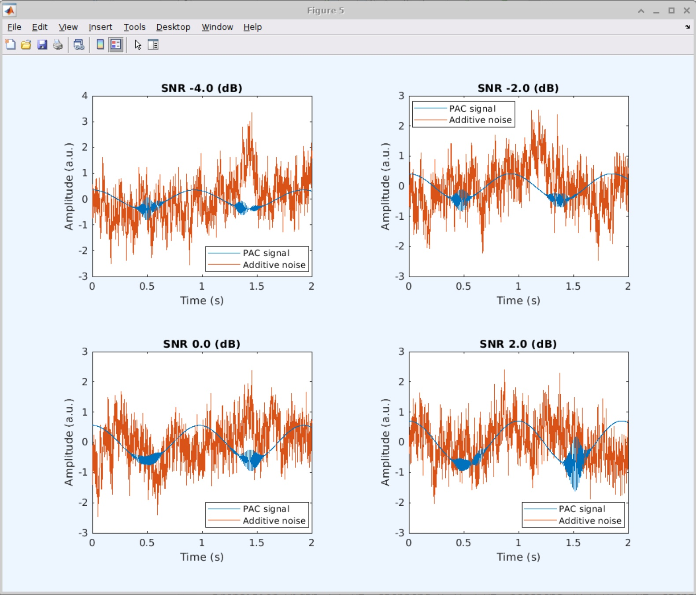

- **Plot the first 2-s of with and without PAC**: When checked, this option opens a separate window to display another line plots that compare PAC Present (yellow) and PAC Absent (purple). One can make the variance of the PAC Absent signal larger or smaller by changing the **Var ratio of without PAC** above in dB.

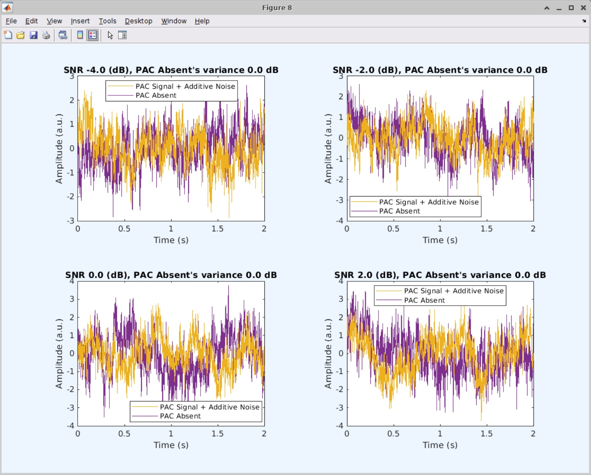

## Example 1: All default parameters, just pressing the 'Start' button.
### 1-1 Showing modulation index (MI) results.
The modulation index (MI) is defined by Canolty et al. (2006). Oezkurt and Schnitzler (2011) also suggests 'direct estimate MI' which is supposed to be as good as robust GLM, but this simulator always gives the near-identical results with the standard MI, so I only show standard MI's result here.
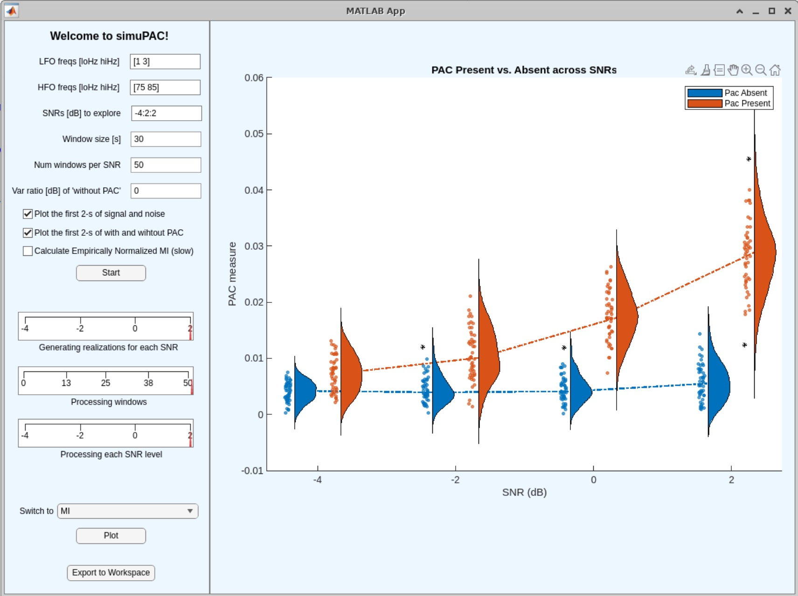

### 1-2 Showing Kullback-Leibler (KL) Divergence (or Distance) results.
KLD is a entropy-based measure proposed by Tort et al. (2010). It is good at separating PAC Present from PAC Absent, but the variance of the metric within the condition is much larger than other measures.
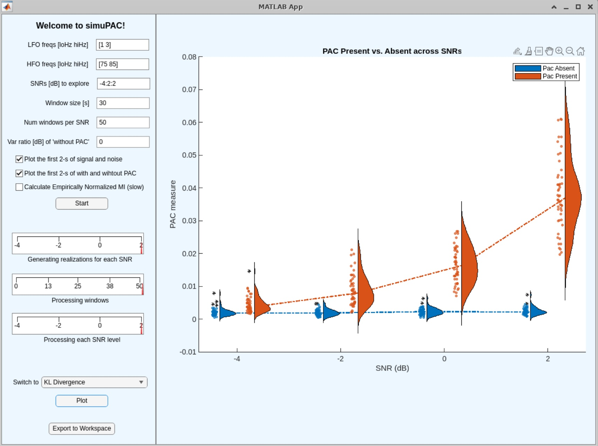

### 1-3 Showing robust general linear model (GLM) results.
This approach uses the low-freq phase as a regressor to explain the temporal pattern of high-freq amplitude power changes. 'Robust' means it ignores the intercept which represents data of non-interest i.e. differences in variances between the two signals compared. See the code used in this simulator. Note that beta_coef(3) is not included in the equation.

```matlab
X = [cos(currentWinPhase) sin(currentWinPhase) ones(length(currentWinZ),1)];
[beta_coef, redundant_term, error_trms] = regress(currentWinAmp, X);
robustGLM = 0.5 * sqrt ( (beta_coef(1)^2 + beta_coef(2)^2) / sum(currentWinAmp.*currentWinAmp)  );
```
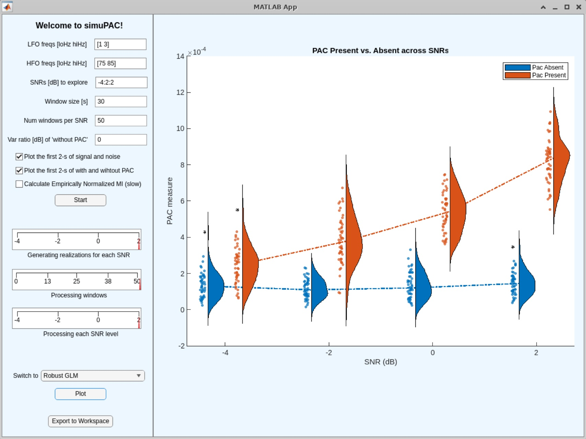

## Example 2: Introducing variance imabalance (+20 dB in PAC Absent) between PAC Present and PAC Absent.
Note that the purple line (PAC Absent) is 10 times larger in variance than the yellow line (PAC Present).
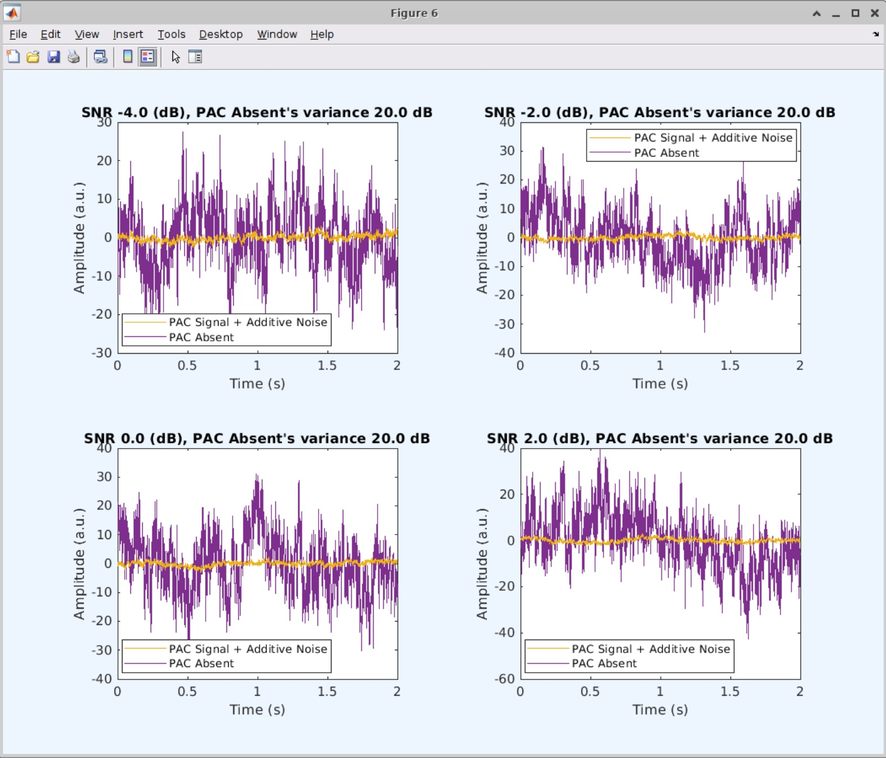

### 2-1 Showing MI results--it fails!
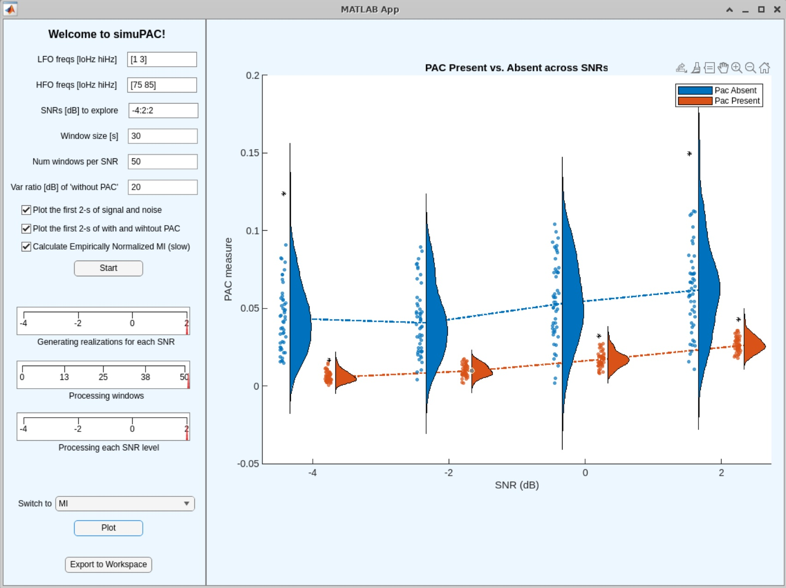

### 2-2 Showing normalized MI results--it holds! 
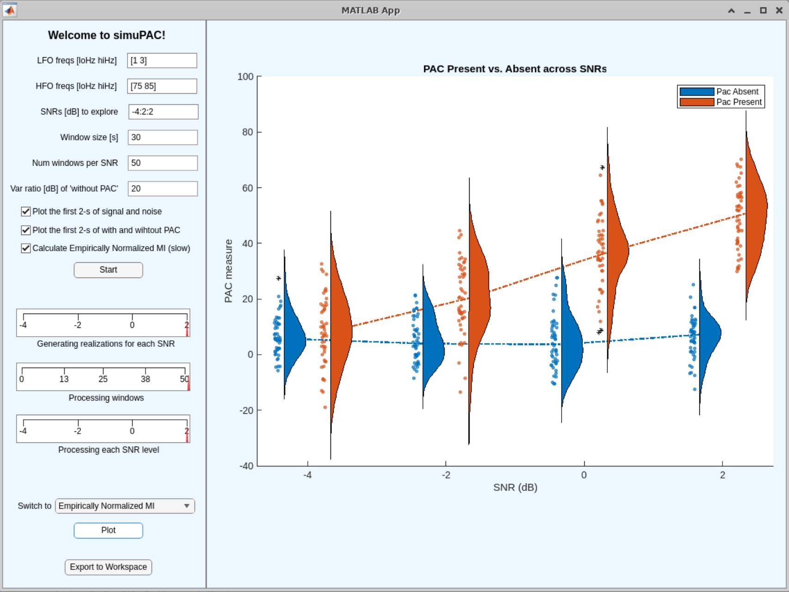

### 2-3 Showing KLD--it holds!
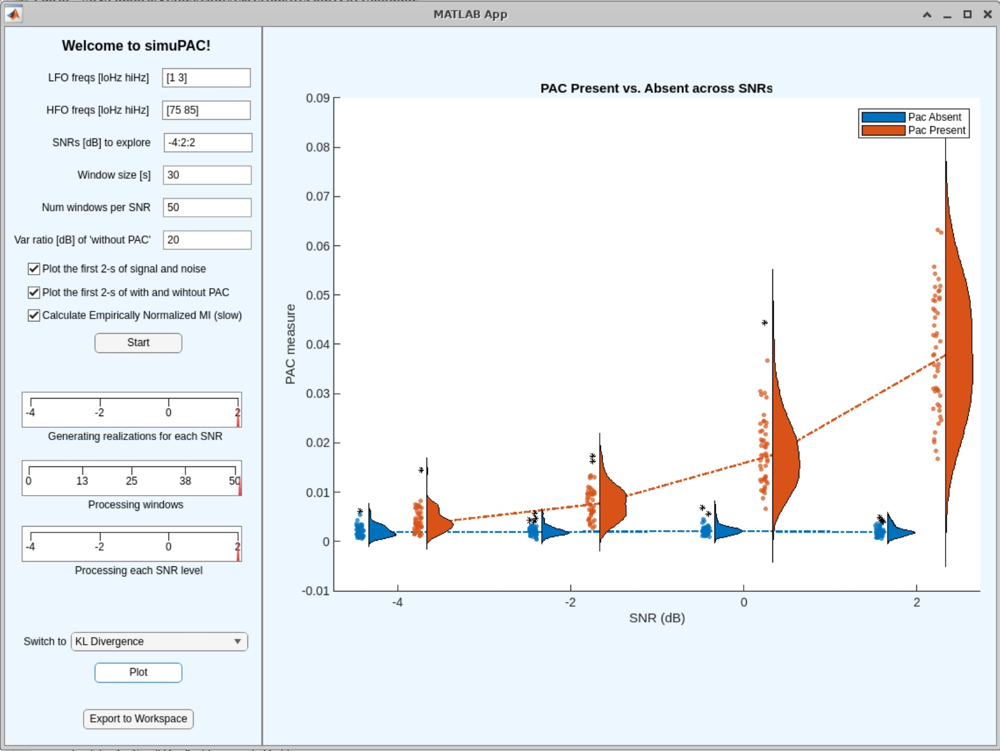

### 2-4 Showing robust GLM--it holds!
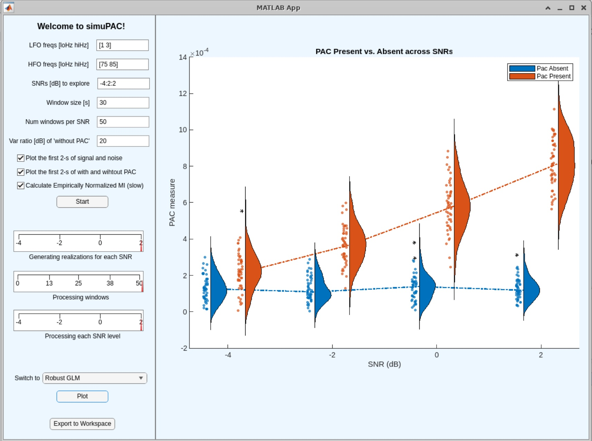

## Conclusion and comments
1.Overall winner is robustGLM. It is much faster compared to normMI, too.
2.Internally, all three variants of GLM studied by Oezkurt and Schnitzler (2011) are calculated. However, unless the pair of input vectors, PAC Present and PAC Absent, are exactly normalized to the same variance, standard GLM or equivalent-to-GLM keep failing. Even when PAC Present and PAC Absent are normalized as a whole data, the subsampled windows have local deviation from the overall variance, thus these GLM variants fail. When the inputs time series of PAC Present and Absent are exactly normalized, the results are identical to that of robust GLM. From here, we can learn what it means by excluding the intercept term i.e. beta_coeff(3) from the equasion.
